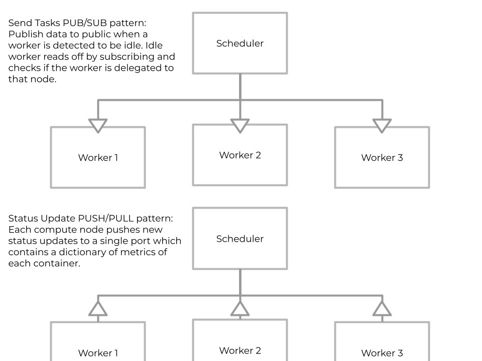

# BL-Armada 🛳
Breakthrough Listen Armada - internal "custom orchestration" for some distributed ML work. Used to spawn workloads to process data. Facilitates some basic networking infrastructure to monitor and distribute workload in a round robin fashion. 

## Spawn Containers
In a series of scripts spawning containers has been made possible to initalize the enviroments. The way in which the containers are spwaned follows a simple series of threaded commands. 
1. First Head node specifies how many nodes and how many instances on each node
2. Second for each node we split resources evenly and start up instances
3. With resources spawned we can then go on waking up scheduler.
recall some basic singularity commands 
```
singularity instance list
singularity instance stop -a
```
The command to spawn instances is:
```
bash start_workers.sh -u 1
```
The command to spawn scheduler is:
```
bash start_scheduler.sh
```
If you are too lazy to run any of that just run
```
bash init.sh
```
And to clear everything and stop the all containers
```
bash stop.sh
```
## Networking
The networking aspect is simple. The scheduler collects the status of the workers by pulling, and the pushes come from the containers. The messages will reference which compute node it came from. Then the scheduler loops through the status of the nodes and 
if the node is idle, we give it a job by publishing openly to a port which the idle node is subscribed to. The idle node checks that 
it is meant to run this job and then the compute node gets busy and is updated. 
